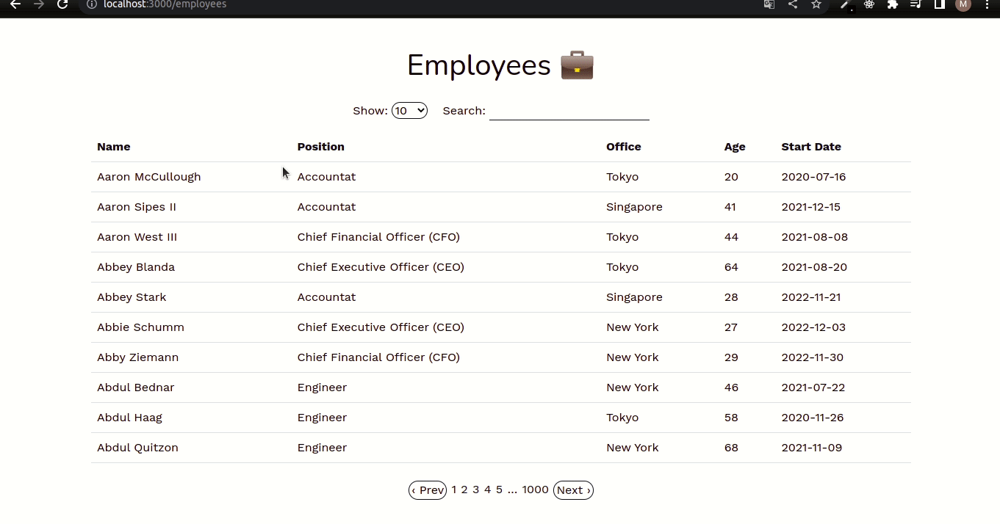

# Hotwire Datatables

### Employees datatable built using Hotwire and Turbo Frames

 - Rails app generated with [lewagon/rails-templates](https://github.com/lewagon/rails-templates), created by the [Le Wagon coding bootcamp](https://www.lewagon.com) team.
 - Based on [GoRails](https://gorails.com/) tutorial - Datatables From Scratch Using Hotwire

### Local environment setup instructions:

Run in the app folder terminal:
1. `bundle install` - to install all the gems
2. `yarn install` - to install all the JavaScript dependences
3. `rails db:create db:migrate db:seed` - to create, migrate and populate the DB
4. `rails s` - to start the server
